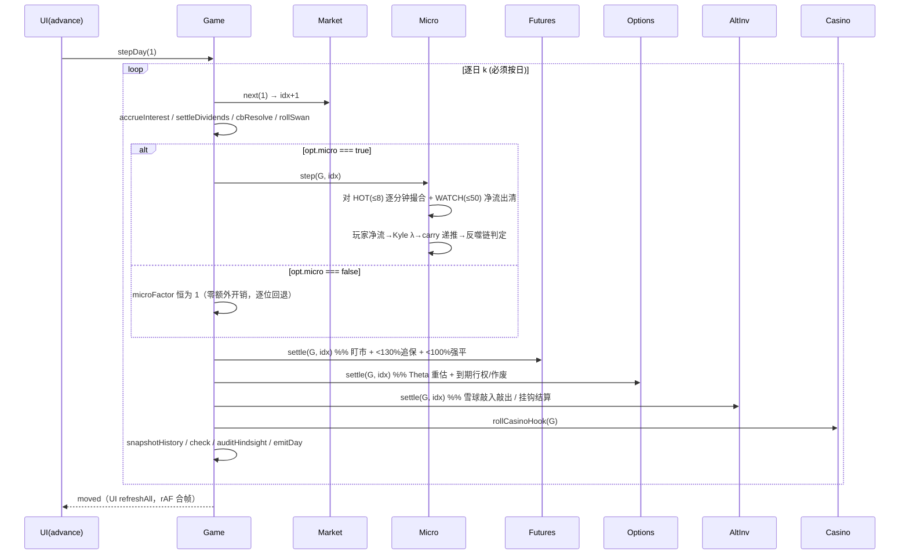
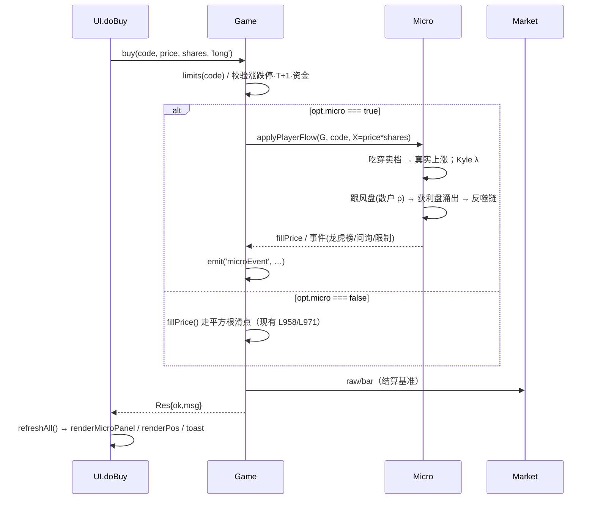
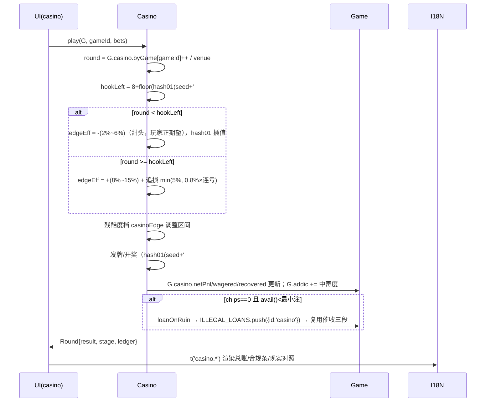
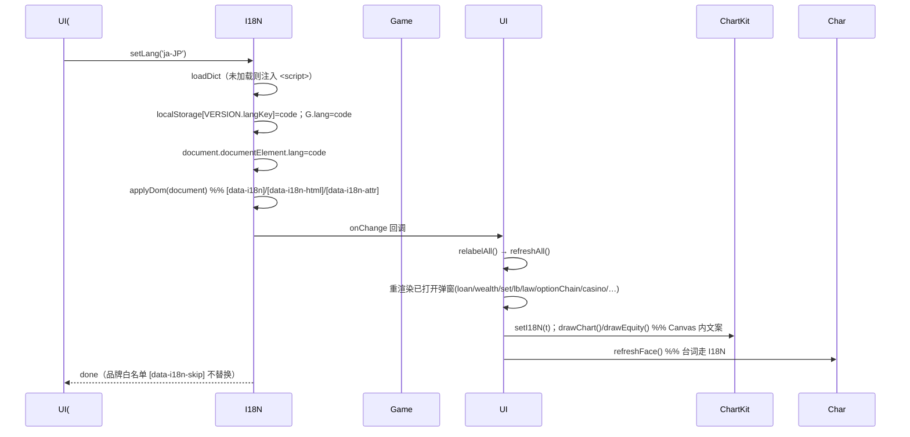
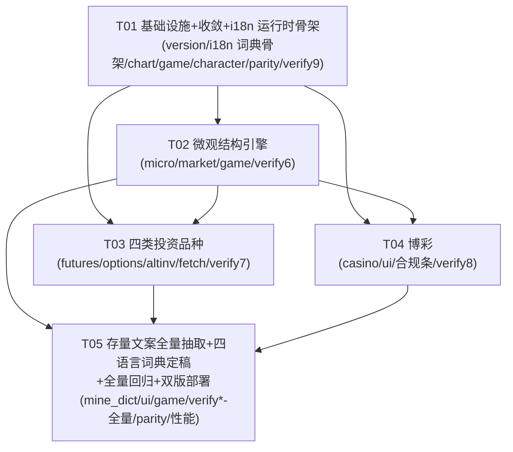

# 增量架构设计 v2 —— 另类投资品种 · 博彩 · 多语言 · 市场微观结构

- **文档类型**：增量架构设计 + 任务分解（对应 PRD v2）
- **上游输入**：`docs/prd/2026-09-28-increment-investments-gambling.md`（965 行）
- **落地范围**：`stock-sim`（FX战士·韭留美）与 `stock-sim-teiai`（帝爱炒股模拟器）**两版**
- **硬约束**：纯静态 / 零构建 / 零后端 / 原生 ES5·ES6；数据构建期固化入 `data/snapshot.js`；现有 `verify*.js` / `verify-teiai.js` 全绿；`opt.micro=false` 时 `px` 逐位回退 `raw.c × k` 且 `k===1`；一切随机性走 `hash01(seed+…)`
- **不改代码**：本文档只做设计，不落地任何源码改动

---

## 0. 现状锚点（设计与改动的基准，均经逐行核对）

| 模块 | 关键事实（文件:行/函数） |
|---|---|
| 行情引擎 | `assets/js/market.js`（488 行，两版**逐字节相同**）。`S` 状态含 `meta/dates/series/scale/byCode`；`ZONE` 映射见 L47-50（`main/gem/star→A, us→US, hk→HK, fx→FX, fd→FD, rp→RP, wm→WM, cb→CB`，`index→IDX`）；`init()` L46-67；`raw(code,i)` L102；`bar()` L115（实时覆盖末根）；`price()` L140；`restored(code,i)` L374（**由 OHLC 合成 48 点分时**）；`avgVol(code,n)` L180；公共 API L474-486 |
| 价格形成(v1) | `assets/js/game.js`：`kAt=bfactorAt×swanFactor`（L1176-1178）；`px(code,i)=raw.c×k`（L1179-1185，**k===1 时走 `Market.price` 快路径**）；`pxChg` L1187；`shadowed` L1194 |
| 扰动 | `bfactorAt` L1022-1045（蝴蝶，缓存 `bfacCache`）；`swanFactor` L1130-1160（黑天鹅，缓存 `swanCache`，**rp/wm 不参与** L1134）；`rollSwan` L1067；`auditHindsight` L1219（3 日前视 >6% 强化蝴蝶） |
| 冲击成本(v1) | `impactSlip` L958-968：`slip=min(0.025, sqrt(ratio)×0.20)`；`fillPrice` L971-978（买入上滑/卖出下滑，夹在 `b.l*k..b.h*k`）——**只改成交价，不改价格路径** |
| 账户/风控 | `G` L263-295；`equity()` L345；`usedMargin()` L349；`avail()` L354；`marginRatio()` L355；`limits()` L399；`check()` L785（<130% 追保 / <100% 强平）；`stepDay(n)` L723-742（**逐日循环**：`accrueInterest→settleDividends→cbResolve→rollSwan→snapshotHistory→check→auditHindsight→emitDay`）；`accrueInterest` L744 |
| 交易 | `buy` L449 / `buyLong` L460 / `openShort` L530 / `sell` L590 / `sellLong` L596 / `coverShort` L646 / `closeAll` L688；`lot()` L316（可转债 10 张，其余 100 股） |
| 开关/存档 | `DEF_OPT` L77-86（8 项全开）；`setOpt` L1197；`SAVE_KEY/LB_KEY` L21-22（**两版唯一 game.js 差异**）；`save` L1929 / `restore` L1968 / `reset` L2027；`bSeed` 于 `reset` L2045 落种子 |
| 视图 | `assets/js/ui.js`（1734 行）。`S` L9-14；`cache()` L26；`bind()` L1543；`refreshAll()` L708（rAF 合帧）；`buildWatch` L83；`renderPos` L327；`renderTop` L387；`renderHud` L413；`shadowBars` L539；`drawChart` L567；`renderLoan/renderWealth/renderSet/renderLb/renderLaw`；公共 API L1726 |
| 图表 | `assets/js/chart.js`：`candles/minute/equity/prep/fmt/kvol`（L331）。**帝爱版已抽 `THEME`+`setTheme()`/`rgba()`（差 110 行），韭留美版仍硬编码常量 L8-10** |
| 角色 | `assets/js/character.js`：`face/FACES/line/lineForState/mood`（L254/L237/L317/L340/L323），`LINES` L296。**两版实现完全不同**（韭留美二次元颜艺 vs 帝爱六边徽记），但对外契约一致 |
| 启动 | `assets/js/main.js`：`setupIntro` L27、`start` L83、`wireEvents` L112（Game 事件→表演）、`startLive` L259。`index.html` 脚本顺序 L412-418：`snapshot→character→chart→market→game→ui→main` |
| 数据 | `tools/fetch_data.py`（852 行，两版相同）：`POOL` L34、`gen_synth` L285、`WM_PRODUCTS` L313、`FX_PAIRS` L322、`US_LIST` L333、`DIV_CODES` L373、`src_tencent/src_eastmoney/src_sina` L396/428/466、`discover_us_codes` L487、`src_tencent_us` L510、`main()` L626（5 pass：腾讯→腾讯US→新浪US→东财→新浪；对齐 L742；除权反推 L806；输出 L829 `{m,d,s,dv,syn,news}`） |

**两版差异实测（`diff -q`，本次增量之前）**

| 文件 | 差异行数 | 差异性质 |
|---|---|---|
| `market.js` / `data/snapshot.js` / `tools/fetch_data.py` | **0** | 逐字节相同 |
| `game.js` | 6 | **仅 `SAVE_KEY`/`LB_KEY` 两行常量** |
| `ui.js` | 28 | **2 处主题色 + 10 处台词文案** |
| `chart.js` | 110 | 帝爱已 `THEME/setTheme`，韭留美硬编码（**同一主题，不同抽象度**） |
| `character.js` | 485 | 完全不同的皮肤实现（同契约） |
| `main.js` | 112 | 启动编排/文案 |
| `index.html` | 147 | 皮肤/品牌/文案 |
| `style.css` | 1887 | 整套皮肤 |

> **结论**：两版差异 = 「主题色 + 存储键 + 语气文案 + 皮肤」，**逻辑层几乎无差异**。这正是决策 1 的立足点。

---

# Part A：系统设计

## 1. 实现方案与选型

### 1.1 核心技术难点

1. **订单流定价与 v1「历史×扰动」的兼容**——必须既让订单流接管定价（P0-C4），又在关闭时逐位回退（P0-C8），且**不能破坏 `verify5.js` 对 `Game.px === Market.price` 的精确断言**（见 §1.4 与 §10.1）。
2. **两版不写两遍**——本次新增代码量（micro + 4 类品种 + 博彩 + i18n）远大于存量。
3. **零构建下的 i18n 全量覆盖 + 缺 key 可观测**。
4. **性能预算**：`stepDay(1)` < 50ms（标准档）/ < 120ms（硬核档），243 标的 × 520 日可接受。
5. **确定性**：赌场/代理/合成行情全部 `hash01`，**禁止 `Math.random()`**（P0-A1），且 `stepDay` 逐日推进（分红/可转债/黑天鹅/期货盯市/赌场钩子按日触发）。

### 1.2 框架与库选型

**结论：零新增运行时依赖。** 浏览器端不引入任何 npm/打包产物；图表继续手写 Canvas（`chart.js`）；i18n 自研（约 120 行）；micro 引擎自研。理由：零构建硬约束 + 现有 verify 依赖 `window.*` 全局、真实浏览器、无 bundler。

Python 侧（`tools/fetch_data.py`）**允许新增**（仅构建期、不进产物），见 §7。

### 1.3 架构模式

延续现状 **「IIFE 单例 + 全局命名空间 + 事件总线」**：
- 全局单例：`window.Market`、`window.Game`、`window.UI`、`window.Char`、`window.ChartKit`，**新增** `window.I18N`、`window.Micro`、`window.Futures`、`window.Options`、`window.AltInv`、`window.Casino`、`window.VERSION`。
- 事件总线：`Game.on(fn)`（L2084）+ `Game.emit`（L297）→ 已在 `main.js::wireEvents` 消费；新增 `I18N.onChange(cb)`。
- 状态单一来源：`Game.G` 为唯一可变状态；**新的共享引擎不持有私有可变状态**，全部通过参数 `G` 操作（依赖注入），从而「一份代码服务两版」。

### 1.4 三个架构级决策（结论 + 理由 + 风险）

---

#### 决策 1 —— 两版引擎如何收敛，避免「写两遍」

**选型：(b) 分层收敛 ——「新增能力全部落共享文件 + 存量的版本差异下沉为 version/dict/皮肤」**

**具体契约**

1. **【共享·逐字节一致】新增逻辑一律放在以下文件**，两版内容完全相同：
   - `assets/js/i18n.js`（i18n 运行时）
   - `assets/js/micro.js`（订单簿 / 5 类代理 / 撮合 / Kyle λ / 分时聚合 / 引力锚）
   - `assets/js/futures.js`（期货 + 贵金属实物/积存金）
   - `assets/js/options.js`（BSM 定价 + 期权链 + 持仓）
   - `assets/js/altinv.js`（数字资产 + 私募/信托/结构性）
   - `assets/js/casino.js`（14 玩法 + 钩子曲线 + 总账）
   - 既有共享：`assets/js/market.js`、`data/snapshot.js`、`data/lang/{zh,ja,en,ko}.js`、`tools/fetch_data.py`
2. **【各版独立】新增一个薄配置 `assets/js/version.js`**（约 25 行），承载两版唯一的显式差异：
   ```js
   window.VERSION = {
     id: 'kurumi',                 // 或 'teiai'
     saveKey: 'kurumi_save_v1',    // 帝爱版: 'teiai_save_v1'
     lbKey:   'kurumi_lb_v1',
     langKey: 'fxsim_lang_v1',     // 两版可共用（语言偏好）
     theme:   null,                 // 帝爱注入 chart 主题；韭留美 null 用默认主题
     brand:   { /* 不翻译白名单：名称/徽记文字/法律条文编号 */ },
     dictOverride: 'override'       // 语气覆盖层文件名
   };
   ```
3. **存量文件的处理（克制、最小改动）**：
   - `game.js`：L21-22 常量改读 `VERSION.saveKey/lbKey`；`save_key` 导出（L2088）继续返回该值（`verify5.js` L616 依赖 `Game.save_key`）。
   - `chart.js`：**把韭留美版硬编码常量（L8-10）改为 `THEME` 引用**，与帝爱版对齐到同一 `THEME/setTheme/rgba` 契约（数值保持默认一致 → 视觉不变 → verify 不受影响）。
   - `ui.js`：2 处硬编码色改 `var(--gold)` / `var(--up)`；10 处台词改 `t(key)`（见决策 3）。
   - `character.js`：`LINES`（L296）改造为「返回 i18n key」，两版各自提供 `char.*` 词典（语气差异落词典，不落代码）。

**为什么不做「全量 core 迁移」**：`game.js`/`ui.js` 的公共符号被 6 套 verify 大量引用（`Game.G/px/kAt/bfactorAt/swanFactor/fillPrice/impactSlip/save_key/…`、`UI.S/buildWatch/select/layoutBars/…`、`Char.lineForState`）。把存量整体搬进 core 需重接每一处符号并重跑全套 verify，风险/收益不划算。**新增走共享、存量做薄接线**能在拿到「写一遍」的 90% 收益同时，把回归风险压到最低。

**迁移成本**：`game.js` 2 行、`chart.js` 韭留美约 40 行、`ui.js` 12 处、`character.js` 台词外置。**均为低风险机械改动**。

**保证迁移后 verify 全绿的手段**
- 保持全局符号名与签名**只增不改**（`window.Market/Game/UI/Char/ChartKit` 不变）。
- `theme` 默认值与现硬编码值**逐位一致**（颜色字符串相同）。
- 新增 `tools/check_parity.py`：跨两版 diff 全部共享文件（含新增模块），**任一不一致即 fail**；并入验证流程（§10.2）。防止长期漂移。

**风险**：共享文件被误改单边 → 由 `check_parity.py` 兜底；`chart.js` 主题抽象若有笔误致配色偏差 → verify 只断言无 error/DOM 文本、不断言像素，故不影响绿灯，但需人工目检截图。

---

#### 决策 2 —— 增量四如何与现有影子价架构共存

**三层模型（对齐 PRD §0.3）**

```
L0   基准层  ：历史 OHLCV（market.js::raw）——固定剧本，不改写
L0.5 影子层  ：k = bfactorAt × swanFactor（现有，保留）
L1   微观层  ：订单簿 + 5 类代理撮合 + Kyle λ（新增，micro 开启时接管定价）
```

**关键接口演进（先穷举调用点再设计）**

现有 `px/kAt` 的调用点（全部经核对）：
- `game.js` 内部：`marketValue` L330、`unrealized` L333、`usedMargin` L351、`fillPrice` L971、`runDca` L1385、`closeAll` L695。
- `ui.js`：`Game.pxChg`（`buildWatch` L94、`updateWatch` L124、`renderIndexStrip` L140、`renderPos` L336、`renderTop` L392、`genHeadlines` L162/177/197/217/226）、`Game.px`（`shadowBars` L551、`fillPrice` L643、`select` L730、`renderPos` L336）、`Game.kAt`（`shadowBars` L551、`drawChart` L570、`limits` 内部、`renderTop` L394）、`Game.shadowed`（L400）。
- `verify5.js`：`Game.px`（L371/376/506/545/566/573/597/614/664/665）、`Game.kAt`（L580/584）、`Game.bfactorAt`（L503/505）、`Game.swanFactor`（L367/370/375）。

**设计：`px()` 保持唯一「上报口径」，micro 以「乘子」接入，绝不改签名。**

```js
// game.js 内，唯一改动点
function microFactor(code, i) {            // 新增
  if (!G.opt || G.opt.micro === false) return 1;   // ← 硬返回数字 1（关闭即逐位回退）
  return Micro.factor(G, code, i);                 // 无扰动时为 1
}
function kAt(code, i) {                    // 由 kAt = bf × swan 演进为三者相乘
  return bfactorAt(code, i) * swanFactor(code, i) * microFactor(code, i);
}
function px(code, i) {                     // 现存 k===1 快路径原样保留
  const ii = (i === undefined) ? Market.idx : i;
  const k = kAt(code, ii);
  if (k === 1) return (ii === Market.idx) ? Market.price(code)
                                          : (Market.raw(code, ii) || { c: 0 }).c;
  const b = Market.raw(code, ii);
  return b ? b.c * k : Market.price(code) * k;
}
```

**不变量保持的证明**
- `opt.micro===false` ⇒ `microFactor≡1` ⇒ `kAt` 与演进前**逐位相同** ⇒ `px` 逐位回退 `raw.c×k`。**满足 P0-C8 与现有 verify 降级断言。**
- 全扰动关闭（butterfly=0 且无 swan 且无玩家 micro 偏离）⇒ `kAt = 1×1×1 = 1` ⇒ `bfactorAt` 返回字面量 `1`（L1023 已有），`kAt===1`，`px` 走 `Market.price` 快路径。**满足「k===1 不变量」。**

**引力锚（Gravitational Anchor）数学形式**

以对数偏离定义锚定回归（OU 过程的离散化）：

```
锚 A(code,i)   = raw.c(code,i) × (bfactorAt × swanFactor)          // L0+L0.5
玩家冲击项     = Kyle：imp(code,i) = λ_sqrt(level) × sign(flow_i) × sqrt(|flow_i| / ADV(code))
回归项         = −θ_eff · ln(P_prev / A)   （软回归，见下）
ln P(code,i)   = ln A(code,i) + carry_i
carry_i        = clamp( carry_{i-1} · exp(−θ_eff·1) + imp_i , −cap, +cap )   // 日频递推（cap=±0.5）
θ_eff          = θ_base(level) · g_liq(ADV) · h(|carry|)
                = (ln2 / H(level)) · g_liq · h(|carry|)
```

- **半衰期 `H(level)`**（无流动性修正时的基准半衰期，交易日）：
  | 档位 `microLevel` | 含义 | `H`（日） | `λ_sqrt` |
  |---|---|---|---|
  | 0 关闭 | 严格回退 | — | — |
  | 1 简化 | 回归强、接近历史 | 8 | 0.006 |
  | 2 标准(默认) | — | 20 | 0.010 |
  | 3 硬核 | 回归弱、更独立 | 40 | 0.015 |
- **回归强度随 |偏离| 增大**：`h(|carry|) = clamp(1 + |carry|/σ_d, 1, 6)`（σ_d 为标的日波动）。
- **回归强度随 microLevel 降低而增强**：`H` 随档位下降而缩短 ⇒ θ=ln2/H 增大（见上表）。
- **回归强度随流动性升高而增强**：`g_liq(ADV) = clamp(0.6 + 0.4·log10(ADV/ADV_ref), 0.6, 1.6)`，`ADV_ref = 1e8` 元。
- **`carry` 是「玩家驱动」的**：`imp_i` 仅由**当日玩家净订单流 `flow_i`** 产生（NPC 净流按锚定校准，贡献 0，见下）。因此 **无玩家交易 ⇒ `carry≡0` ⇒ `P = A`**，`microFactor = P/A = 1`。

**`microFactor` 的语义**
```js
Micro.factor(G, code, i) = exp(carry_i)      // carry≡0 ⇒ exp(0)=1.0（IEEE 精确 1）
```
> 该式是「关闭逐位回退」与「无玩家即锚定」的技术核心：`exp(0)` 恰为 `1.0`，`A×1.0 === A`。

**「分时由逐笔聚合」如何与锚定共存（P0-C2/C3）**
- 日内按 240 分钟推进：每分钟由 5 类代理 + 玩家订单产生委托 → 分别与 **5 档限价簿**撮合 → 产出 **逐笔成交 tick prints**。
- **校准规则（锚定基线）——仅约束日终收盘**：NPC 代理当日**净**订单流由「须使日终收在 `A`」约束（玩家净流是**唯一**能推动日终偏离锚的力）。
- **【team-lead 裁决 Q-A 的澄清 · 不可妥协】**：**NPC 五类代理不得退化为「填充残差」**。日内逐笔路径与当日 OHLC 形态必须**内生涌现**——开→高→低→收的**路径顺序**、**高低点出现时刻**、**成交量日内分布（U 型）**均须由订单流撮合产生，**禁止**从历史 bar 用线性/正弦插值反推（这正是 `Market.restored()` 的旧做法）。锚定**只**施加在「当日收盘」这**一个标量**上（配一档末端对冲/收盘集合竞价把日内净流残差归零），日内其余时刻价格完全由撮合决定。
- 于是：**分时路径 = 逐笔真实聚合（M2 成立）；日终收盘 = `A × exp(carry)`（锚定 + 玩家冲击）**。这是业界常用的「market simulator calibrated to a target price path」手法。
- `Market.restored()`（L374）**保留**为离线兜底：`micro` 关 / 数据不足 / 非热集标的时使用（PRD Q11）。`ui.js::drawChart` L567 的 `minute` 分支改为优先取 `Micro.minute(code,i)`。

**短期/中期/长期的可验收口径（用代码表达）**
| 尺度 | 断言（新 `tools/verify6.js`） |
|---|---|
| 短期 1~5 日 | 玩家在 t 日净买入 X 后，`dev = |P_player − P_base| / P_base` **在 1~5 日内单调不降**（订单流主导，回归来不及抹平） |
| 中期 20 日 | 停止交易后，`dev` 相对峰值**衰减到 < 60%**（弱相关：既未全回归，也未恒久） |
| 长期 60~120 日 | 停止交易后第 120 日，`|carry| < 3%`（**回归历史锚**）；且实测半衰期落在 `[15, 40]` 日（标准档） |
| 弹性 A1/A2 | 标准档 `X/ADV`：10%→`dev≥0.3%`、50%→`≥0.7%`、100%→`≥1.0%`、300%→`≥1.7%`；`dev` 对 `X/ADV` **单调递增** |
| 小盘易拉 A3 | 同一 X 元，小盘（ADV 小）`dev` **显著大于**大盘 |
| 关闭归零 A4 | `opt.micro=false` ⇒ `dev==0`，且 `px=raw.c×k`、`k===1`（与 verify5 降级断言同源） |
| 确定性 A6 | 同种子同订单 ⇒ 逐笔序列与 `P_player` 完全一致 |
| 反噬 A7 | 净买入 >20%×ADV → 龙虎榜事件；日内 >7% → 异常波动问询 |
| **日内内生性 A9（Q-A 澄清 · 追加断言）** | 无玩家交易日的分时序列**不等于**任何「按历史 bar 的 O/H/L/C 做线性或正弦插值」的结果（与 `Market.restored()` 输出逐点差的 RMS > 阈值）；且高低点出现时刻、成交量分布由撮合涌现 |
| **形态随种子变化 A10（Q-A 澄清 · 追加断言）** | 同种子分时**逐点可复现**；**换种子**分时形态发生变化（形状距离 > 阈值）——证明路径由订单流而非插值决定 |

**性能落地（对齐 PRD §7.3）**
- **热集 `HOT` = 持仓 ∪ 选中标的（≤8 只）**：跑完整订单簿（240 分钟 × 5 代理 × 5 档），`stepDay(1)` < 50ms（标准）/< 120ms（硬核）。**热集变化时重算**（`Micro.setHot(codes)`）。
- **轻量集 `WATCH` = 可见分区行 ∪ 自选（≤50 只）**：只算「净流 + Kyle λ 出清」，不做撮合，摊销 < 5ms/只。
- **其余 ≈200 只**：**懒计算**——不进入每日循环，`px/k` 纯函数按需（UI 访问时）求值，摊销 < 0.5ms/只。**这是达成「单日推进 < 150ms」的关键**：`stepDay` 只触碰 `HOT∪WATCH`。
- `micro` 关闭：`microFactor` 立即返回 1，`settleMicro` 整段跳过 ⇒ 零额外开销。

---

#### 决策 3 —— i18n 零构建且覆盖全量文案

**运行时 `assets/js/i18n.js`（约 120 行，无依赖）**
```js
window.I18N = (function () {
  const DICTS = {};                    // { 'zh-CN': {...}, 'ja-JP': {...}, ... }
  let lang = 'zh-CN', fallback = 'zh-CN';
  const listeners = [], missing = [];
  let STRICT = true;                   // 开发/验证期严格；缺 key 可见报错，不静默回落
  function t(key, params) {
    const d = DICTS[lang] || {}, f = DICTS[fallback] || {};
    let s = d[key];
    if (s === undefined) {
      if (STRICT) { missing.push(lang + ':' + key); console.error('[i18n] missing ' + lang + ':' + key); }
      s = f[key];
      if (s === undefined) return '⟦' + key + '⟧';   // 可见占位，绝不静默
    }
    return params ? s.replace(/\{(\w+)\}/g, (_, k) => (params[k] != null ? params[k] : '{' + k + '}')) : s;
  }
  function tN(key, n, params) {                      // 极简复数：en 读 .one/.other，其余读 .other
    const suffix = (lang === 'en-US' && n === 1) ? '.one' : '.other';
    return t(key + suffix, Object.assign({ n }, params || {}));
  }
  function setLang(code) {
    if (!DICTS[code]) loadDict(code);                // 动态注入 <script>，零构建
    lang = code;
    try { localStorage.setItem(window.VERSION.langKey, code); } catch (e) {}
    document.documentElement.lang = code;
    applyDom(document);
    listeners.forEach(f => f(code));
  }
  function getLang() { return lang; }
  function onChange(cb) { listeners.push(cb); }
  function applyDom(root) {                          // 静态文案替换
    root.querySelectorAll('[data-i18n]').forEach(n => { n.textContent = t(n.dataset.i18n); });
    root.querySelectorAll('[data-i18n-html]').forEach(n => { n.innerHTML = t(n.dataset.i18nHtml); });
    root.querySelectorAll('[data-i18n-attr]').forEach(n => {         // "placeholder:key|title:key2"
      n.dataset.i18nAttr.split('|').forEach(pair => { const [a, k] = pair.split(':'); if (a && k) n.setAttribute(a, t(k)); });
    });
  }
  function fmtMoney(n, opts) { /* 千分位 + CNY 标注；en/ja/ko 前缀 "CNY ¥" */ }
  function fmtDate(iso) { /* zh:2025-06-12 ja:2025年6月12日 en:Jun 12, 2025 ko:2025.06.12 */ }
  return { t, tN, setLang, getLang, onChange, applyDom, fmtMoney, fmtDate, missing, loadDict, setStrict: v => STRICT = v };
})();
```

**词典文件格式与加载顺序**
- `data/lang/zh.js`（**权威基准**）、`ja.js`、`en.js`、`ko.js`：**扁平 key-value**，`window.I18N_DICTS = window.I18N_DICTS || {}; Object.assign(window.I18N_DICTS['zh-CN'], {...})`（便于 diff 与校验）。
- `index.html` 脚本顺序（**i18n 需先于 ui/game**）：
  ```html
  <script src="data/snapshot.js"></script>
  <script src="assets/js/version.js"></script>      <!-- 1. 版本差异（saveKey/brand/theme） -->
  <script src="assets/js/i18n.js"></script>          <!-- 2. i18n 运行时 -->
  <script src="data/lang/zh.js"></script>            <!-- 3. 基准词典（总是加载） -->
  <script src="data/lang/override.zh.js"></script>   <!-- 4. 本版语气覆盖 -->
  <script src="data/lang/ja.js"></script><script src="data/lang/en.js"></script><script src="data/lang/ko.js"></script>
  <script src="data/lang/override.ja.js"></script> ...
  <script src="assets/js/character.js"></script><script src="assets/js/chart.js"></script>
  <script src="assets/js/market.js"></script>
  <script src="assets/js/micro.js"></script><script src="assets/js/futures.js"></script>
  <script src="assets/js/options.js"></script><script src="assets/js/altinv.js"></script>
  <script src="assets/js/casino.js"></script>
  <script src="assets/js/game.js"></script><script src="assets/js/ui.js"></script>
  <script src="assets/js/main.js"></script>
  ```
  （为控制首屏体积，也可**只内联 zh + 当前语言**，其余经 `I18N.loadDict` 动态 `<script>` 注入——二选一，默认「全内联」，体积见 §6.4。）

**缺 key 降级策略（P0 要求「开发期必须可见」）**
- 默认 `STRICT=true`：缺 key → `console.error` + 渲染 `⟦key⟧`（**可见**），并累计到 `I18N.missing`。
- 构建/验证期：`tools/mine_dict.py` 比对四语言 key 集合一致 + 无空值，缺失即**非零退出**；`verify9.js` 断言 `I18N.missing.length===0`。
- 仅在异常兜底路径允许 `setStrict(false)`。

**HTML 静态文案替换**
- 全部硬编码中文改为 `data-i18n="key"`（textContent）/ `data-i18n-html="key"`（含 `<b>` 等标签）/ `data-i18n-attr="placeholder:key|title:key"`（属性）。
- 启动时 `main.js::boot$`（L286）在 `Market.init` 后、`setupIntro` 前调用 `I18N.setLang(读档语言 || localStorage || 'zh-CN')` + `I18N.applyDom(document)`。
- 品牌/不翻译白名单元素标 `data-i18n-skip` 或不加 `data-i18n`（永不替换）。

**带参数 / 复数 / 拼接串规范（禁令）**
- 参数用 `{name}`：`t('toast.feeOver', { n: 5 })`。
- **禁止** `t('a') + t('b')` 式拼接——**整句一个 key + 占位符**（例：`toast.bought: '买入成交 {name} {shares} {unit}'`）。
- 数量相关用 `tN('xxx', n)`（en 读 `.one/.other`；中/日/韩读 `.other`），不做 ICU。
- 数字/日期走 `I18N.fmtMoney/fmtDate`，不走 `t`。

**两版语气不同如何处理（决策 1 的一部分）**
- 共享词典（`data/lang/*.js`）承载**中性、两版共用**的 key（导航/表头/按钮/合规条/风险警示）。
- **语气差异落「覆盖层」**：各版 `data/lang/override.{zh,ja,en,ko}.js` 仅覆盖**有语气差异的少量 key**（`char.*` 全部 + ui.js 那 12 处差异串 + 品牌文案）。加载顺序保证 override 在后 ⇒ 覆盖共享值。
- 帝爱品牌层（`帝愛グループ`/`TEIAI SECURITIES`/`帝爱炒股模拟器`/徽记文字/`FX战士·韭留美`）由 `VERSION.brand` 提供，**任何语言不翻译**。
- 映射示例（`ui.js` L666）：韭留美 `char.shortOpen = '空单开好了！跌下来就是利润～'` vs 帝爱 `char.shortOpen = '融券卖出已成交。价格下跌即为盈利。'`。

**切换语言时重渲染所有已打开的面板**
- `main.js` 注册：`I18N.onChange(() => { UI.relabelAll(); })`。
- `UI` 新增 `relabelAll()`：重跑 `I18N.applyDom(document)` → `refreshAll()`（L708）→ 对**每个可能打开的弹窗**重渲染：`renderLoan/renderWealth/renderSet/renderLb/renderLaw` + 新增 `renderOptionChain/renderCasino/renderFutures/renderAlt/…`（仅当其 DOM 非 hidden）。
- Canvas 图内文字：`ChartKit` 增加 `setI18N(t)`，把 `'暂无数据'`（L49/190/278）、`'成本'`（L166）、`'均价'`（L263）、`'灰虚线 = 沪深300 基准'`（L328）等改走注入的 `t`；`I18N.onChange` 触发后重绘 `drawChart()/drawEquity()`。
- `character.js::line()`（L317）改为取 `t('char.' + key + '.' + idx)`（idx 由确定性哈希选，**不用 Math.random**——现有 L319 用 `Math.random`，需一并改为 `hash01`）。

---

## 2. 文件列表（相对路径）

图例：**[新]** 新建 · **[改]** 修改 · **[共]** 共享内核（两版逐字节一致） · **[双]** 两版各自一份（皮肤/文案/存储键）

| 相对路径 | 状态 | 范围 | 说明 |
|---|---|---|---|
| `index.html` | 改 | [双] | 脚本顺序、`data-i18n`、`#langBtn`、新分区 tab、期权链/赌场/新增理财页签弹窗 |
| `assets/css/style.css` | 改 | [双] | 新增组件样式（盘口五档/逐笔/参与者/赌场/期权链/语言胶囊） |
| `assets/js/version.js` | 新 | [双] | **两版唯一显式差异**：saveKey/lbKey/langKey/theme/brand |
| `assets/js/i18n.js` | 新 | [共] | i18n 运行时（t/tN/setLang/getLang/onChange/applyDom/fmtMoney/fmtDate） |
| `assets/js/micro.js` | 新 | [共] | 订单簿/5 类代理/撮合/Kyle λ/分时聚合/引力锚/反噬链 |
| `assets/js/futures.js` | 新 | [共] | 期货 + 贵金属实物/积存金（规则常量 + 交易 + 盯市 + 追保强平） |
| `assets/js/options.js` | 新 | [共] | BSM 定价 + 期权链生成 + 买卖/行权/强平 |
| `assets/js/altinv.js` | 新 | [共] | 数字资产 + 私募/信托/雪球/挂钩 |
| `assets/js/casino.js` | 新 | [共] | 14 玩法 + 钩子曲线 + 筹码 + 总账 + 信用联动 |
| `assets/js/market.js` | 改 | [共] | `ZONE` 扩展（FU/OPT/CR/PM/ALT/GM）、`microParams`（adv/float/depth）、`gm` 分区、新增取数 |
| `assets/js/character.js` | 改 | [双] | `LINES` → i18n key；`line()` 的 `Math.random` → `hash01` |
| `assets/js/chart.js` | 改 | [双] | 统一 `THEME/setTheme/rgba`（韭留美采纳帝爱抽象）；注入 i18n |
| `assets/js/game.js` | 改 | [双] | 读 `VERSION`；`microFactor`；新 `G` 字段；`stepDay` 挂载新结算；薄委托共享引擎 |
| `assets/js/ui.js` | 改 | [双] | 新分区/新弹窗渲染、`relabelAll`、语言按钮、micro 面板 |
| `assets/js/main.js` | 改 | [双] | i18n 启动、语言选择、新模块事件接线、`startLive` 支持新分区 |
| `data/lang/zh.js` | 新 | [共] | 基准词典（简中，权威） |
| `data/lang/ja.js` / `en.js` / `ko.js` | 新 | [共] | 日/英/韩词典 |
| `data/lang/override.zh.js` | 新 | [双] | 本版语气覆盖（简中） |
| `data/lang/override.ja.js` / `override.en.js` / `override.ko.js` | 新 | [双] | 本版语气覆盖（日/英/韩） |
| `data/snapshot.js` | 重新生成 | [共] | 新增标的序列 + `mic`（adv）+ meta 扩展 |
| `tools/fetch_data.py` | 改 | [共] | 期货/加密/博彩股/期权标的/ALT 数据源与列表 |
| `tools/check_parity.py` | 新 | [双] | 校验两版共享文件逐字节一致 + 词典 key 完备 + 无 `Math.random` |
| `tools/mine_dict.py` | 新 | [双] | 抽取硬编码中文 → key 骨架；四语言 key 集合比对 |
| `tools/verify6.js` | 新 | [双] | micro 可验收口径（A1–A8） |
| `tools/verify7.js` | 新 | [双] | 期货/期权/数字资产/私募结构化 |
| `tools/verify8.js` | 新 | [双] | 博彩玩法 + 钩子曲线 + 总账 + 信用联动 |
| `tools/verify9.js` | 新 | [双] | i18n 四语言/覆盖/品牌白名单/缺 key |
| `tools/verify5.js` 等既有 | 不改 | [双] | **验收基线，禁止修改** |
| `docs/design/2026-09-28-architecture-v2.md` | 新 | [双] | 本文档 |
| `docs/design/class-diagram.mermaid` | 新 | [双] | 类图 |
| `docs/design/sequence-diagram.mermaid` | 新 | [双] | 时序图 |

> 新增 verify 采用**参数化 URL**（读 `process.env.VERIFY_URL`，默认 `http://127.0.0.1:8777/index.html`），同一套 `verify6~9.js` 可分别对两版（:8777/:8778）运行，减少一套重复。

---

## 3. 数据结构与接口

### 3.1 类图（详见 `docs/design/class-diagram.mermaid`）

```mermaid
classDiagram
  class Snapshot {
    +Array m        %% [code,name,ind,market,limitPct]
    +Array d        %% 交易日 ISO
    +Object s       %% code -> Int16Array×5 (int scaled)
    +Array dv       %% 除权日历
    +Array syn      %% 合成标记（UI 标注「模拟历史」）
    +Array news
    +Object mic     %% code -> adv（微观派生参数）
  }
  class Market {
    +Object S
    +init(snap) int
    +raw(code,i) Bar
    +bar(code,i) Bar
    +price(code) float
    +prevClose(code,i) float
    +series(code,n,end) Bar[]
    +agg(code,unit,n,end) Bar[]
    +avgVol(code,n) float
    +restored(code,i) MinuteSet
    +next(n) int
    +setIdx(i)
    +metaOf(code) Meta
    +isCB/isRepo/isWealth(code) bool
    +scaleOf(code) int
    +microParams(code) {adv,float,depth}
    +isTradable(code) bool
  }
  class Micro {
    +init(G, deps)
    +setHot(codes)
    +step(G, i) void      %% 逐日：推进热集/轻量集
    +factor(G, code, i) float   %% exp(carry)，无扰动=1
    +minute(code, i) Tick[]     %% 逐笔→分钟聚合
    +book(code) Levels          %% 五档
    +agents(code) AgentStat[]   %% 参与者净流入
    +applyPlayerFlow(G, code, X) void
    +anchor(code, i) float
  }
  class Futures {
    +CONTRACTS Map
    +buy(G, code, lots, dir) Res
    +close(G, code, lots) Res
    +settle(G, i) void      %% 每日无负债结算
    +marginRatio(G, code) float
    +buyPm(G, kind, amount) Res
    +redeemPm(G, kind, amount) Res
  }
  class Options {
    +bsm(S,K,r,sigma,tau,kind) float
    +chain(code, i) Chain
    +buy(G, cid, contracts, dir) Res
    +close(G, cid, contracts) Res
    +settle(G, i) void      %% Theta 衰减 + 到期行权
    +marginOf(G, cid) float
    +histVol(code, n) float
  }
  class AltInv {
    +buyCry(G, code, qty) Res
    +sellCry(G, code, qty) Res
    +subscribe(G, pid, amount) Res
    +settle(G, i) void      %% 雪球敲入敲出 / 挂钩结算
    +snowballOutcome(prod, path) Outcome
  }
  class Casino {
    +GAMES Map
    +hookLeft(G, venue) int
    +edgeEff(G, venue, round) float
    +play(G, gameId, bets) Round
    +stageOf(G, venue) str
    +ledger(G) Ledger
    +toxicDelta(bet) float
    +loanOnRuin(G) Res
  }
  class Game {
    +Object G
    +opt Object
    +microFactor(code,i) float
    +kAt(code,i) float
    +px(code,i) float
    +pxChg(code) Chg
    +limits(code) Limits
    +buy/sell(code,price,shares,side) Res
    +fillPrice(code,shares,ref,isBuy) {price,slip}
    +impactSlip(code,shares) {ratio,slip}
    +stepDay(n) int
    +equity/avail/marginRatio() float
    +reset/restore/save(...)
    +hash01(str) float
    +on(fn)
  }
  class I18N {
    +t(key,params) str
    +tN(key,n,params) str
    +setLang(code)
    +getLang() str
    +onChange(cb)
    +applyDom(root)
    +fmtMoney(n,opts) str
    +fmtDate(iso) str
    +missing str[]
  }
  class UI {
    +S Object
    +bind(map)
    +refreshAll()
    +relabelAll()
    +buildWatch()
    +select(code)
    +renderPos/renderTop/renderHud()
    +renderOptionChain()/renderCasino()/renderMicroPanel()
    +drawChart()
  }
  class ChartKit {
    +THEME Object
    +setTheme(t)
    +setI18N(t)
    +candles(cv,bars,opts)
    +minute(cv,arr,prevClose,note)
    +equity(cv,series,bench,labels)
  }
  class Char {
    +face(state,opts) str
    +line(key) str
    +lineForState(state) str
    +mood(summary) str
  }
  class VERSION {
    +id str
    +saveKey str
    +lbKey str
    +langKey str
    +theme Object
    +brand Object
  }
  class Position {+code +shares +cost +side +lots[] +divs[]}
  class FuturesPos {+code +dir +lots +openPrice +settlePrice +marginRate}
  class OptionPos {+code +kind +strike +expiryIdx +dir +contracts +premium +openIdx}
  class AltPos {+pid +amount +startIdx +matureIdx +obs[]}
  class CasinoState {+chips +rounds +wagered +recovered +netPnl +hookLeft{} +byGame{} +stage}
  class MicroState {+carry{} +book{} +events[]}

  Game --> Micro : 委托 factor/step
  Game --> Futures : 委托
  Game --> Options : 委托
  Game --> AltInv : 委托
  Game --> Casino : 委托
  Game --> Market : 取价 kAt
  Game --> I18N : 文案
  UI --> Game : 读状态/下单
  UI --> Market : 行情
  UI --> ChartKit : 绘图
  UI --> I18N : t()
  UI --> Char : 表演
  Micro --> Market : raw/adv
  Micro --> Game : G(种子/opt)
  Futures --> Market : 结算价
  Options --> Market : 标的价/波动率
  AltInv --> Market : 标的口径
  Main..>VERSION : 读取
  Main..>I18N : 启动语言
  MicroState <.. Game
  Position <.. Game
  FuturesPos <.. Game
  OptionPos <.. Game
  AltPos <.. Game
  CasinoState <.. Game
```

### 3.2 公共 API 演进总表（**只增不改**，保证调用方与 verify 不破）

| 单例 | 现有 API（保留） | 新增 API | 语义变更 |
|---|---|---|---|
| `Market` | `S/init/raw/bar/price/prevClose/series/agg/avgVol/restored/next/setIdx/metaOf/isCB/isRepo/isWealth/scaleOf/listIdx/benchLevel/fetch*` | `microParams(code)`、`isTradable(code)`、`isFut/isOpt/isCry/isAlt/isPm/isGm(code)`、`gmList()` | `ZONE` 增 FU/OPT/CR/PM/ALT/GM；`init` 读 `snap.mic` |
| `Game` | 全部（含 `px/kAt/bfactorAt/swanFactor/fillPrice/impactSlip/stepDay/summary/reset/restore/save/save_key/hash01/on`） | `microFactor`、`buyFuture/sellFuture/buyOption/...`（**薄委托**，见 3.3）、`G.futures/options/alts/pm/casino/micro` | `kAt` 由 2 因子→3 因子（microFactor，默认 1 时逐位等价）；`bfactorAt/swanFactor` **语义与返回值不变** |
| `Micro` | — | 见类图 | 新 |
| `Futures/Options/AltInv/Casino` | — | 见类图 | 新 |
| `I18N` | — | 见类图 | 新 |
| `UI` | `bind/refreshAll/select/buildWatch/render*/S/el/…` | `relabelAll`、`renderOptionChain/renderCasino/renderMicroPanel/renderFutures/renderAlt` | `cache()` 增新元素 id |
| `ChartKit` | `candles/minute/equity/prep/fmt/kvol/COLORS` | `THEME`、`setTheme`、`setI18N`、`rgba` | 韭留美版由硬编码常量→`THEME`（默认值一致） |
| `Char` | `face/FACES/line/lineForState/mood/star` | — | `line()` 文案走 `I18N`，随机改 `hash01` |

### 3.3 共享引擎的依赖注入契约（「一份代码服务两版」的关键）

共享模块**不持有私有可变状态**，全部以 `Game.G`（普通对象）为唯一状态源，以 `deps` 注入宿主回调：

```js
// main.js / game.js 初始化（两版相同调用）
Micro.init(Game.G, { hash01: Game.hash01, market: Market, opt: Game.optOf });
Futures.G = Game.G; Options.G = Game.G; AltInv.G = Game.G; Casino.G = Game.G;   // 或统一传参
// game.js 薄委托
function buyFuture(code, lots, dir) { return Futures.buy(G, code, lots, dir); }
function buyOption(cid, contracts, dir) { return Options.buy(G, cid, contracts, dir); }
```

`stepDay`（L723）在逐日循环内插入（顺序对齐 PRD §附录C#2）：
```js
function stepDay(n) {
  for (let k = 0; k < n; k++) {
    const realN = Market.next(1); if (realN <= 0) break; moved += realN;
    accrueInterest(1);
    settleDividends();      // 现有
    cbResolve();            // 现有
    rollSwan();             // 现有
    /* ---- 增量四 ---- */ Micro.step(G, Market.idx);        // 订单流推进（热集+轻量集）
    /* ---- 增量一 ---- */ Futures.settle(G, Market.idx);    // 每日无负债结算 + 追保强平
                           Options.settle(G, Market.idx);    // Theta 重估 + 到期行权
                           AltInv.settle(G, Market.idx);     // 雪球/挂钩结算
    rollCasinoHook(G);      // 赌场钩子计数（按日；若按局则在 play 内）
    G.dayTrades = 0; snapshotHistory(); check(); auditHindsight(); emitDay();
    if (G.ruin || G.dead) break;
  }
  return moved;
}
```

### 3.4 新增存档字段（`save`/`restore`/`reset` 三处同步，旧档兜底）

| 字段 | 结构 | 兜底 |
|---|---|---|
| `G.futures` | `[{code,dir,lots,openPrice,settlePrice,marginRate}]` | `\|\| []` |
| `G.options` | `[{code,kind,strike,expiryIdx,dir,contracts,premium,openIdx}]` | `\|\| []` |
| `G.pm` | `{bar:{grams,cost},accum:{amount,cost}}` | `\|\| {}` |
| `G.alts` | `[{pid,amount,startIdx,matureIdx,obs[],state}]` | `\|\| []` |
| `G.casino` | `{chips,rounds,wagered,recovered,netPnl,hookLeft:{macau,vegas},byGame{},stage}` | `\|\| {chips:0,…}` |
| `G.micro` | `{carry:{}}`（订单簿可不持久化，重算） | `\|\| {}` |
| `G.microEvents` | `[{type:'inquiry'\|'dragon'\|'restrict',code,day}]` | `\|\| []` |
| `G.lang` | `'zh-CN'\|…`（读档以存档为准，同步 `localStorage[VERSION.langKey]`） | `\|\| 'zh-CN'` |
| `opt.micro` | `bool`，默认 `true` | `!== false` |
| `opt.microLevel` | `0..3`，默认 `2` | `=== undefined ? 2 : …` |
| `opt.casinoHook` | `bool`，默认 `true` | `!== false` |
| `opt.casinoEdge` | `0..2`，默认 `1` | `=== undefined ? 1 : …` |

---

## 4. 程序调用流程（详见 `docs/design/sequence-diagram.mermaid`）

### 4.1 日推进（`stepDay(1)`）



### 4.2 下单撮合（micro 开启时的玩家冲击）



### 4.3 赌场单局（确定性钩子曲线）



### 4.4 语言切换



---

## Part B：任务分解

## 5. 依赖包列表

### 浏览器端（运行时）
**零新增依赖。** 全部原生 `fetch`/`Canvas`/`localStorage`/`TextDecoder('gbk')`，与现状一致。i18n、micro、品种引擎、赌场均为自研 IIFE。

### Python 端（构建期，`tools/fetch_data.py`）
| 包 | 现状 | 本次 | 用途 |
|---|---|---|---|
| `urllib` / `ssl` / `json` / `random` / `time` / `os` / `sys` | ✅ 标准库 | 沿用 | HTTP / 解析 / 确定性合成 |
| `concurrent.futures.ThreadPoolExecutor` | ✅ 标准库 | 沿用 | 并发抓取 |
| `requests` | 现状可能已用（见 `fetch_data.py` 头部） | 可选沿用 | 期货 GBK/JSONP 抓取更稳 |
| **新增（可选）** | — | 无强制新增 | 期货 JSONP 剥壳/GBK 解码用标准库即可；若需更强重试可加 `requests`（已列） |

> `tools/check_parity.py`、`tools/mine_dict.py` 仅用标准库（`difflib`/`re`/`json`/`os`）。

## 6. 数据流水线设计（`tools/fetch_data.py` 扩展）

### 6.1 新增列表（**规则常量不进 snapshot**，只进序列/meta）

```python
# 期货：真实历史优先（新浪 JSONP），取不到则 gen_synth（UI 标「模拟历史」）
FUT_LIST = [  # (code, name, ind, market, base参考价, vol, sina_symbol)
  ("futAU", "沪金主力", "贵金属", "fut", 560,  0.012, "AU0"),
  ("futAG", "沪银主力", "贵金属", "fut", 7500, 0.018, "AG0"),
  ("futSC", "原油主力", "能源",   "fut", 552,  0.022, "SC0"),
  ("futRB", "螺纹钢主力","黑色",  "fut", 3210, 0.015, "RB0"),
]  # 合约乘数/保证金率/涨跌停 → 放 assets/js/futures.js（不进快照）

CRY_LIST = [  # 数字资产：真实数据（Binance 官方公共数据域，见 §6.2）→ 合成仅作兜底
  ("cryBTC", "比特币", "数字资产", "cry", 460000, 0.040, "BTCUSDT"),
  ("cryETH", "以太坊", "数字资产", "cry", 23000,  0.045, "ETHUSDT"),
]  # base/vol 仅在「数据源不可达」兜底用；默认走真实日线
# ALT 产品（私募/信托/雪球/挂钩）：不抓序列，仅 meta + 标的口径指针 → 放 assets/js/altinv.js 常量表
```

**POOL 追加**：`sh510050`（期权标的 50ETF）、6 只博彩港股（`ind='博彩'`）：
`hk01928 金沙中国 / hk00027 银河娱乐 / hk01128 永利澳门 / hk00880 澳博控股 / hk02282 美高梅中国 / hk00200 新濠国际发展`
**US_LIST 追加**：`usLVS 拉斯维加斯金沙 / usMGM 美高梅 / usWYNN 永利度假村 / usCZR 凯撒娱乐`（`ind='博彩'`）。

### 6.2 新增数据源函数

| 函数 | 实现要点（**必须与实测事实一致**） |
|---|---|
| `src_sina_fut(symbol, n)` | `https://stock.finance.sina.com.cn/futures/api/jsonp.php/var%20t=/InnerFuturesNewService.getDailyKLine?symbol={sym}`；**剥 JSONP 外壳**（`var t=(…);` 取括号体）；**GBK 解码**；字段 `d,o,h,l,c,v,p,s` → `[[d,o,c,h,l,v]]`。AU0 自 2008 起全量。 |
| `src_tencent_fut` | **不实现**——实测 `qt.gtimg.cn/q=nf_*` 返回 `v_pv_none_match`（腾讯不认前缀）。期货实时无可用源（浏览器端受 Referer/CORS 限制）⇒ **实盘模式下期货降级为「最近收盘 + 微观推演」并在 UI 如实标注**。 |
| `src_binance_vision(symbol, n)`（**主源**） | `https://data-api.binance.vision/api/v3/klines?symbol=BTCUSDT&interval=1d&limit={n}`（Binance **官方公共数据域**）。**实测 HTTP 200、CORS `*`、浏览器运行期可直连**；日线（最多 500 条）/ 实时价（`/api/v3/ticker/price`）/ 24h 涨跌（`/api/v3/ticker/24hr`）均可用 → **数字资产默认走真实数据**。构建期亦用同一域固化历史。 |
| `gen_synth`（**仅兜底**） | 仅当 `data-api.binance.vision` 请求失败时回退合成，并在 `syn` 标记 → UI 标 `模拟历史（数据源不可达）`。 |
| `src_okx` / `src_coingecko` | **不实现**（实测不可达）；保留域名常量备未来可达。 |
| 美股后缀自动发现 | **复用现有 `discover_us_codes()`（L487，读实时 `f[2]`）**；⚠️ **严禁硬编码** `usLVS.N/usMGM.N/usBYD.N(NYSE)`、`usWYNN.OQ/usCZR.OQ/usDKNG.OQ/usPENN.OQ(NASDAQ)`——写错只返回 1~2 行。 |
| 东财期货 | **不实现**（`secid=113./114./115.AU0` 全无效，限流极严）。 |

### 6.3 数据源优先级（沿用现有 5 pass 范式）
期货：`src_sina_fut`（真实）→ `gen_synth`（标注合成）。
加密：`src_binance_vision`（**真实**，构建期 + 运行期均可）→ 失败才 `gen_synth`（标注 `模拟历史（数据源不可达）`）。博彩港股：走现有 `pass1`（腾讯）→ 回退合成。博彩美股：走现有 `pass2/pass3`（腾讯US→新浪US，**后缀自动发现**）→ 回退合成。期权：**不抓历史**，运行时 BSM 生成（PRD Q7）。

### 6.4 `snapshot.js` 格式演进与体积控制

| 变更 | 内容 |
|---|---|
| `m`（meta） | 新增行：期货/加密/博彩股/`sh510050`；`gm` 分区**派生**自 `ind==='博彩'`（`market.js` 侧），**不改 5 字段结构**（可选增强：加第 6 字段 `gm`） |
| `s`（series） | 期货/加密/博彩股各 1 条序列；`scale`：期货/加密=100，期权无 |
| `syn` | 标注合成标的（期货回退 / 加密 / 回退的博彩股）→ UI 「模拟历史」 |
| **`mic`（新增）** | `{ code: adv }`（**只存 20 日均成交额**，float/depth 由前端从 adv + 价格派生）——最小化体积 |
| 不落盘 | 期权合约（Q7）、ALT/PM 序列（由标的口径计算）、**全部规则常量**（合约乘数/保证金率/λ/代理参数/钩子参数 → 落 JS） |

**体积**：现有 243 标的 ≈ 3.31MB。新增 4 期货 + 2 加密 + 10 博彩股 + 1 ETF ≈ 17 条 × 520×5 int → **≈ +0.23MB ⇒ 合计 ≈ 3.5~3.8MB**（目标 ≤ 4MB）。控制手段：① 博彩港股并入 POOL 复用抓取；② 期权/ALT 不落盘；③ 常量不进快照。输出前 `assert os.path.getsize(out) < 4.2e6`（软告警）。

### 6.5 降级/合成「标注口径」（**定稿**，Q-A/team-lead 更正后）

> 原则：**是真实数据就不标；只有真的降级/合成才如实标注**。数字资产经 team-lead 更正为**真实数据**，默认**不标注**；风险面仅剩「期货实盘模式无实时行情」。

| 场景 | UI 标注 | 对应 i18n key（示例） |
|---|---|---|
| **期货 · 实盘模式（无实时行情）** | `代理报价 · {ETF名称}（该模式无期货实时行情）`，仅在**实盘同步**模式显示；历史回放模式不显示（历史为真实日线） | `fut.proxyQuote`：`"代理报价 · {etf}（该模式无期货实时行情）"` |
| **数字资产 · 正常** | **不标注**（真实数据，`data-api.binance.vision`） | — |
| **数字资产 · 兜底合成** | `模拟历史（数据源不可达）` | `cry.synthFallback` |
| **期货 · 兜底合成** | `模拟历史` | `fut.synth` |
| **博彩股 · 兜底合成** | `模拟历史` | `gm.synth` |

**期货代理标的映射**（`fut.*` 与 ETF 的对应，落 `assets/js/futures.js` 常量）：
`futAU → sh518880（黄金ETF）`、`futSC → sh501018（南方原油LOF）`、`futRB → sz159985（豆粕ETF）`；`futAG` 无对应 ETF，实盘模式显示 `暂无代理报价（该模式无期货实时行情）`。
> `{ETF名称}` 走 `t('fut.proxyQuote', {etf: <名称>})`，**禁止字符串拼接**（∑ 见 §8 跨文件约定）。

## 7. 依赖包列表
见 §5。

## 8. 共享知识 / 跨文件约定

| 类别 | 约定 |
|---|---|
| **命名** | 全局单例 `window.<Name>`；内部函数 camelCase；i18n key `模块.子模块.名称`（前缀 `app/hud/watch/trade/chart/pos/wealth/loan/casino/fut/opt/cry/alt/set/law/char/micro/toast/err/badge/lang`，见 PRD 附录D） |
| **单位/精度** | 价格缩放 `scale`（股价=100；汇率/净值=10000；**期货/加密=100**）；期权权利金 4 位小数（0.0001 元/份）。**澄清（Q-B 拍板）**：PRD「数字资产最小 0.001 枚」是**数量精度规则**（属 `game.js` 撮合约束，与 snapshot 的 `scale`＝**价格精度**无关）；BTC≈¥46 万 ×100 = 4.6e7 在 JS number 内完全安全，2 位小数对 BTC/ETH 足够，故 `scale=100`。成交量沿用序列原生单位 |
| **金额格式** | JS 侧 `UI.money()`（万元缩写）与 `I18N.fmtMoney()`（千分位 + `CNY ¥` 标注）并存；**en/ja/ko 必须带 `CNY ¥`** |
| **日期** | 内部 ISO `YYYY-MM-DD`；展示走 `I18N.fmtDate`（zh/ja/en/ko 四种格式） |
| **精度与舍入** | 涨跌停/成交价保留 2 位（`Math.round(x*100)/100`，沿 L423）；订单流内部用 `double`，仅展示层舍入 |
| **配色** | 四语言**统一红涨绿跌**；颜色走 `ChartKit.THEME` 与 CSS 变量（`--up/--down/--gold`），**禁止在 ui.js 硬编码 hex** |
| **随机性** | 一律 `hash01(seed + '#…' + idx)`（`Game.hash01` L1010）；**禁止 `Math.random()`**（现存 `character.js` L319 需改造） |
| **确定性** | 同存档同种子 ⇒ 逐笔/开奖/合成一致；`stepDay` **逐日循环** |
| **开关默认** | `micro:true`、`microLevel:2`、`casinoHook:true`、`casinoEdge:1`；其余沿用 `DEF_OPT`（8 项全开） |
| **错误处理** | 业务函数返回 `ok(ok,msg,cls)`（L1915），**不 throw**；UI 路径不抛异常；i18n 缺 key **可见报错**，不静默 |
| **合规** | 「澳门」全文写「**中国澳门**」；赌场常驻合规条（四语言）；无美化/诱导文案 |
| **降级/合成标注** | 见 §6.5 定稿：真实数据不标；仅实盘期货无实时行情 / 合成兜底才标注；文案走 i18n key，禁拼接 |
| **不翻译白名单** | 品牌（`帝愛グループ/TEIAI SECURITIES/帝爱炒股模拟器/徽记文字/FX战士·韭留美`）、标的代码、法律条文编号、单位币种 —— 打 `data-i18n-skip` 或由 `VERSION.brand` 提供 |
| **`.genie`/产物** | 无 |

## 9. 性能设计

| 粒度 | 范围 | 做法 | 目标 |
|---|---|---|---|
| 完整订单簿 | 持仓 ∪ 选中（**≤8**） | 240 分钟/日，5 档 LOB + 5 类代理撮合 + 逐笔 tick | `stepDay(1)` **< 50ms**（标准）/< 120ms（硬核） |
| 轻量代理 | 可见分区 ∪ 自选（**≤50**） | 净流 + Kyle λ 出清，**不做撮合** | 摊销 < 5ms/只 |
| 引力锚 | 其余 **≈200** | **懒计算**：不进每日循环，UI 访问时按 `px/k` 纯函数求值 | 摊销 < 0.5ms/只 |
| 全量回放 | 243×520 | **懒计算**：只算玩家实际经过的 (code, day) | 首屏 < 3s；单日推进 < 150ms |
| 渲染 | 分时/盘口/逐笔 | 增量更新 + `refreshAll` rAF 合帧（L708 已有）；`micro` 关整块跳过 | 60fps |

**达成要点**：① 引入 `Micro.setHot(codes)`，`stepDay` 只遍历 `HOT∪WATCH`；② 逐笔 tick 只在「选中标的 + 分时视图」物化；③ `micro` 关闭时 `settleMicro` 整段短路（`microFactor` 立即返回 1）；④ 硬核档若超预算，自动对 `HOT` 中非选中标的降级为轻量（`microLevel` 运行时软降级，UI 标注）。

**前置假设（重排后修正）**：性能压测与新增面板渲染的**唯一前置**是「**T01 的 i18n 运行时已就绪**」——新增 UI（micro 面板 / 期货 / 期权 / 赌场）以 `t(newKey)` 直接编写，**不依赖存量文案抽取完成**；`I18N.missing.length===0` 这一**强断言属 T05**（存量抽取后），**不在** T02~T04 的验收范围内（否则会造成「性能/功能任务被文案抽取阻塞」的假依赖）。性能压测本身在 **T05** 执行（标准/硬核档 `stepDay(1)` 实测）。

## 10. 风险与回滚方案

### 10.1 风险清单
| # | 风险 | 影响 | 缓解 |
|---|---|---|---|
| R1 | **micro 默认开 + `verify5.js` 断言 `pxOffDiff===0`（L398）冲突** | 现 verify 变红 | **设计内解（team-lead 已采纳）**：`microFactor=exp(carry)`，NPC 净流**仅锚定日终收盘** ⇒ 无玩家交易时 `carry≡0` ⇒ `factor=1` ⇒ `px` 逐位等于 `Market.price`；日内逐笔路径仍由订单流内生涌现（见 Q-A 澄清）。**verify6 复刻该断言 + A9/A10 做守卫** |
| R2 | 两版共享文件漂移 | 长期维护崩坏 | `tools/check_parity.py` 逐字节校验共享文件 + 词典 key 完备 + 无 `Math.random`，并入验证 |
| R3 | i18n 缺 key 静默回落 | 多语言残缺不可见 | 默认 `STRICT`：`console.error` + `⟦key⟧` + `I18N.missing`；`verify9` 断言 missing 为空；`mine_dict.py` 构建期 fail |
| R4 | 性能超预算（240min×8 标的） | 卡顿 | 懒计算 + 热集 + 运行时软降级（§9） |
| R5 | snapshot 体积膨胀 | 首屏变慢 | 只存 adv 不存 depth/float；期权/ALT 不落盘；常量进 JS；输出前体积断言 |
| R6 | **期货实盘模式无实时行情**被误当"实时"（⚠️ **已更正：数字资产改走真实数据 `data-api.binance.vision`，风险面缩小至此一项**） | 误导 | UI 按 **§6.5 定稿**标注 `代理报价 · {ETF名称}（该模式无期货实时行情）`；合成兜底标 `模拟历史` |
| R7 | `chart.js` 主题抽象笔误 | 配色偏差 | 默认值逐位沿用；人工目检截图（verify 不断言像素） |
| R8 | 期权/期货 P0 数量多致延期 | 排期风险 | 见 §12 T03/T04 的 P0 优先级；P1（波动率曲面/希腊字母/多期滚动/成就）置后可裁 |

### 10.2 回滚路径
1. **最小回滚（无需回退代码）**：所有新能力均有 `opt.*` 开关。**`opt.micro=false` ⇒ `px` 逐位回退 v1（保证 verify 绿）**；`opt.casinoHook=false`/`casinoEdge` 关闭赌场；据此可「带故障上线、按开关熄火」。
2. **共享内核回退**：本次**新增**文件（`i18n/micro/futures/options/altinv/casino`）删除 + `index.html` 4 段 `<script>` 移除即可回到 v1；`market.js` 仅增 `ZONE`/`micParams`，可定点还原。
3. **版本快照回退**：`git tag pre-increment-v2`；任一 verify 变红时先回 `market.js` + `index.html` + `game.js(kAt/microFactor)` 这三处最小集。
4. **两版一致性回退**：`check_parity.py` 报错时，以「较新一版共享文件」为源覆盖另一版（脚本自动同步）。

## 11. 待明确事项 → **拍板结果（team-lead 已裁定，2026-09-28）**

| # | 事项 | **裁定** | 澄清 / 落地要求 |
|---|---|---|---|
| Q-A | micro 与 verify5 `pxOffDiff===0` 的兼容手法 | **采纳「无玩家净流时 NPC 校准到锚」** | **⚠️ 关键澄清**：NPC 净流校准**只约束日终收盘**，**不得把 NPC 流退化成「填充残差」**。五类代理须**内生**生成日内逐笔路径与当天 OHLC 形态（路径顺序/高低点时刻/量能分布由订单流涌现，禁止从历史 bar 插值）。追加验收断言 **A9（分时 ≠ 线性/正弦插值）+ A10（同种子可复现、换种子形态变化）**（见 §1.4 决策2 表）。 |
| Q-B | 数字资产 `scale` 与「最小 0.001 枚」的矛盾 | **`scale = 100`** | **澄清**：「最小 0.001 枚」是**数量精度规则**（属 `game.js` 的撮合约束），与 snapshot 的 `scale`（**价格精度**）无关——已写入 §8 跨文件约定，消除 PRD 自相矛盾印象。BTC≈¥46 万×100=4.6e7 在 JS number 内安全。 |
| Q-C | `gm` 分区形态 | **派生** `ind==='博彩'` | 零 schema 变更（不改 meta 5 字段结构）。 |
| Q-D | 赌场甜头期跨场 / 离场重置 | **各场独立计算 `hookLeft`；离场再进场不重置、不补发甜头** | **不可协商约束**（堵「刷甜头」的关键）；写进 `casino.js` 常量与 `verify8` 断言。 |
| Q-E | 语言切换是否覆盖 Canvas 图内文字 | **是** | `ChartKit.setI18N(t)` + `I18N.onChange` 触发重绘。 |
| Q-F | 新增 verify6~9 如何跑两版 | **`VERIFY_URL` 参数化，一套套件跑两版** | 默认 `http://127.0.0.1:8777/index.html`，帝爱版传 `:8778`。 |

> **另有一项事实更正（覆盖 R3/原"返工点#3"）**：**数字资产已确认可走真实数据**——`https://data-api.binance.vision`（Binance 官方公共数据域）HTTP 200、CORS `*`、浏览器运行期可直连，日线 500 条 / 实时价 / 24h 涨跌均实测可用；合成**仅作请求失败兜底**。故「加密不可达」的旧判断作废，降级标注口径已按 §6.5 **定稿**：仅「期货实盘模式无实时行情」需标注。

---

## 12. 任务列表（有序 · ≤5 · 每条含依赖/负责人/文件/验收点）

> **硬约束**：共 **5 个任务**；第一个为「项目基础设施」；每条 ≥3 个相关文件；实施顺序 **T01 i18n 运行时骨架 → T02 micro → T03 品种 → T04 博彩 → T05 存量抽取+全量回归+双版部署**（对齐 PRD ①i18n→②micro→③品种→④博彩→⑤verify→⑥部署）。
> **本轮重排（team-lead 裁定）**：原 T01 的「存量文案**全量抽取**」**下移**至 **T05**（待 T02~T04 新 UI 文案冻结后**一次性**抽取）；T01 收窄为「**i18n 运行时**就绪」。T02/T03/T04 的前置统一改为「**T01 的 i18n 运行时已就绪**」，**而非**「存量已抽取完毕」。

### T01 — 项目基础设施 + 两版收敛骨架 + i18n **运行时（骨架，不含存量文案抽取）**
- **优先级**：P0 · **负责人角色**：engineer（前后端）/ qa（verify9） · **依赖**：无（**阻塞全部后续**）
- **涉及文件**：`assets/js/version.js`[新,双] · `assets/js/i18n.js`[新,共] · `data/lang/{zh,ja,en,ko}.js`[新,共]（**骨架**：结构性 key + 新功能 key 命名规范；**本阶段不抽取存量中文**） · `data/lang/override.{zh,ja,en,ko}.js`[新,双]（骨架） · `assets/js/chart.js`[改,双]（统一 `THEME/setTheme/rgba` + `setI18N` 钩子） · `assets/js/game.js`[改,双]（读 `VERSION`） · `assets/js/character.js`[改,双]（`line()` 的 `Math.random` → `hash01`） · `assets/js/main.js`[改,双]（i18n 启动 + 语言选择接线） · `index.html`[改,双]（脚本顺序 + `#langBtn` + 品牌 `data-i18n-skip`） · `tools/check_parity.py`[新] · `tools/verify9.js`[新]（**仅运行时行为**）
- **关键交付（顺序）**：
  1. `version.js` 收敛 `SAVE_KEY/LB_KEY`（game.js L21-22 改读 `VERSION`）→ 两版 game.js 差异归零。
  2. `i18n.js` 运行时（§决策3 API）+ 4 词典**骨架** + override 层骨架。
  3. `#langBtn` + 切换链路（`I18N.setLang/onChange` → `UI.relabelAll` → `ChartKit.setI18N` 重绘），品牌白名单 `data-i18n-skip`。
  4. `check_parity.py`（共享文件逐字节 + 词典 key 完备 + 无 `Math.random`）。
- **为后续任务提供的前提（重排要点）**：T02/T03/T04 的**新增 UI**一律**直接以 `t(newKey)` 编写**、只登记**新 key**（zh-CN 先填、其余语言可暂留空），**不依赖存量文案已抽取**——本任务只需保证「**i18n 运行时已就绪**」这一前置成立即可。
- **验收点**：① `verify.js~verify5.js` + `verify-teiai.js` **全绿**（回归基线）；② `verify9` **运行时用例**通过：4 语言**可切换即时生效**、帝爱品牌 `data-i18n-skip` 不翻译、`fmtMoney/fmtDate` 正确；③ `check_parity.py` 通过（两版共享文件一致）；④ 无 `Math.random` 违规。
- **⚠️ 边界说明**：`I18N.missing.length===0` 的**强断言本阶段不成立**（存量中文尚未抽取）；该断言连同 `mine_dict.py` 全量抽取**整体移至 T05**。

### T02 — 市场微观结构引擎（先关闭态逐位回退骨架，再撮合/代理/Kyle/反噬）
- **优先级**：P0 · **负责人角色**：engineer / qa（verify6） · **依赖**：T01（**前置 = i18n 运行时已就绪**，非「存量已抽取完毕」；新增面板文案直接 `t(newKey)`）
- **涉及文件**：`assets/js/micro.js`[新,共] · `assets/js/market.js`[改,共]（`ZONE` FU/OPT/CR/PM/ALT/GM + `microParams(adv/float/depth)` + `isTradable`） · `assets/js/game.js`[改,双]（`microFactor` + `kAt` 三因子 + `stepDay` 挂 `Micro.step` + `G.micro/microEvents`） · `assets/js/ui.js`[改,双]（`renderMicroPanel`：五档/逐笔/参与者/你的冲击） · `index.html`[改,双]（micro 面板容器 + 设置项） · `assets/js/main.js`[改,双]（`Micro.init`）· `data/snapshot.js`[重新生成]（`mic`）· `tools/fetch_data.py`[改,共]（`mic` 派生）· `tools/verify6.js`[新]
- **关键交付（顺序）**：
  1. **先做「关闭态逐位回退骨架」**：`Game.microFactor` 返回 1 + `kAt` 三因子接线 + `opt.micro/opt.microLevel`（默认 true/2）——此时功能为空但**回归必须全绿**（先证明不破基线）。
  2. 订单簿 + 5 类代理 + 撮合 + 逐笔 → 分时聚合（`Micro.minute`）。
  3. Kyle λ + 引力锚（OU，半衰期表）+ `carry` 递推 + `applyPlayerFlow`。
  4. 反噬链（跟风/问询/龙虎榜/限制交易）+ `microLevel` 四档 + 性能分层（热集/轻量/懒）。
- **验收点**：`verify6` 通过 A1–A8（§决策2 表）：弹性单调、定量门槛、小盘易拉、**关闭归零 `dev==0` 且 `px=raw.c×k`、`k===1`**、分时来自逐笔、确定性、反噬触发、`stepDay(1)` < 50ms；**并复刻 verify5 的 `pxOffDiff===0` 断言做守卫（R1）**；回归全绿。

### T03 — 四类投资品种（期货与贵金属 / 期权 / 数字资产 / 私募·信托·结构性）
- **优先级**：P0 · **负责人角色**：engineer / qa（verify7） · **依赖**：T01（**i18n 运行时已就绪**）、T02
- **涉及文件**：`assets/js/futures.js`[新,共] · `assets/js/options.js`[新,共] · `assets/js/altinv.js`[新,共] · `assets/js/game.js`[改,双]（薄委托 + 新 `G` 字段 + 三处存档同步 + `stepDay` 挂 settle） · `assets/js/ui.js`[改,双]（期货/期权/数字资产/博彩分区渲染 + 期权链弹窗 + 理财新增 2 页签） · `index.html`[改,双]（新分区 tab + 期权链弹窗 + 理财页签 + 设置项） · `data/snapshot.js`[重新生成] · `tools/fetch_data.py`[改,共]（`FUT_LIST/CRY_LIST` + `src_sina_fut` JSONP 剥壳 + 博彩股 + 后缀自动发现） · `assets/css/style.css`[改,双] · `tools/verify7.js`[新]
- **关键交付**：
  - 期货：4 合约（乘数/保证金率/双向/T+0/手续费，常量 `futures.js`）、每日无负债结算、<130% 追保 / <100% 强平（强平**优先于**涨跌停判定，PRD Q6）、贵金属实物/积存金。
  - 期权：50ETF/300ETF 链（BSM 简化，σ=60 日历史波动率，r=2%）、买方/卖方、义务仓保证金、到期行权/作废、**合约不落盘**（Q7）。
  - 数字资产：BTC/ETH、`limitPct=0`、ALL 级黑天鹅敏感度 ×1.6、`CNY ¥` 标注、合成标「模拟历史」。
  - 私募/结构化：门槛/锁定期/**不可转让**（Q8）、雪球 4 情形成立、挂钩 `90%+60%×max(涨幅,0)`。
- **验收点**：`verify7` 通过（期货双向/T+0/盯市/强平；期权链/行权/卖方强平；加密无涨跌停+标注；私募门槛+雪球 4 情形+挂钩公式；存档往返）；回归全绿；两版共享文件一致。

### T04 — 博彩（14 玩法 + 钩子曲线 + 总账 + 信用联动 + 合规条）
- **优先级**：P0 · **负责人角色**：engineer / qa（verify8） · **依赖**：T01（**i18n 运行时已就绪**——合规条四语言走 `t()`；不依赖存量抽取）、T02（价格无关，但 UI 复用）
- **涉及文件**：`assets/js/casino.js`[新,共] · `assets/js/ui.js`[改,双]（赌场全屏弹窗 + 总账面板 + 钩子曲线折叠区） · `index.html`[改,双]（赌场弹窗 + 底部「赌场」按钮 + 首次进场合规确认） · `assets/css/style.css`[改,双] · `assets/js/game.js`[改,双]（`opt.casinoHook/opt.casinoEdge` + `G.casino` + 存档 + `emit`） · `assets/js/main.js`[改,双]（赌场事件接线） · `data/lang/*.js`[改,共]（`casino.*` 四语言） · `tools/verify8.js`[新]
- **关键交付**：≥12 玩法（中国澳门 8 / 拉斯维加斯 7，共 14，见 PRD §5.6）；钩子曲线（`hookLeft` 8~15、甜头 −2%~−6%、惩罚 +8%~+15%、追损 +0.8%/次、3 档残酷度）；独立筹码 1:1 兑换/换回；**强制总账面板**（含「折合 X 个月工资」现实对照）；中毒度联动；**输光现场放贷接入 `ILLEGAL_LOANS(id='casino')` 复用催收三段**；常驻合规条（「中国澳门」全文正确）；首次进场强制合规确认（Q4）。
- **验收点**：`verify8` 通过（≥12 玩法可达；甜头期有效庄家优势为负、惩罚期为正；追损加速；3 档可切；总账字段齐；固定种子开奖可复现；合规条四语言且「澳门」措辞正确；信用联动/催收触发）；回归全绿。

### T05 — 存量文案**全量抽取** + 四语言词典定稿 + 全量回归 + 双版部署
- **优先级**：P0 · **负责人角色**：qa（主）+ engineer · **依赖**：T02、T03、T04（**须待全部新功能 UI 文案冻结后一次性抽取**）
- **涉及文件**：`tools/mine_dict.py`[新]（**本阶段才落地**）· `index.html`[改,双]（存量中文 → `data-i18n`）· `assets/js/{ui,game,main,character,chart}.js`[改,双]（存量中文 → `t()`）· `data/lang/{zh,ja,en,ko}.js`[改,共]（**全量 key 定稿**）· `data/lang/override.{zh,ja,en,ko}.js`[改,双]（语气层定稿）· `assets/css/style.css`[改,双]（皮肤收尾）· `tools/verify*.js`[运行,不改] · `tools/verify-teiai.js`[运行,不改] · `tools/verify6~9.js`[运行] · `tools/check_parity.py`[运行] · `docs/design/*`
- **关键交付（顺序）**：
  1. `mine_dict.py` 抽取存量硬编码中文（`ui.js` 1734 行 / `game.js` 2119 行 / `index.html` / `character.js` / `main.js`）→ `t()` + key（**须处理拼接串/模板串**）。
  2. 四语言词典补全（**key 集合四语言一致、无空值**）+ override 语气层（两版差异定稿）。
  3. 跑齐 `verify.js~verify5` + `verify-teiai` + `verify6~9`（**两版各跑，`VERIFY_URL` 参数化**）。
  4. **性能预算压测**（标准档/硬核档 `stepDay(1)` 实测）+ `check_parity.py` 通过 + 快照体积断言。
  5. 双版部署（GitHub Pages 子路径，`SAVE_KEY` 两版隔离）+ 回归修复 + 文档归档。
- **验收点**：**全部既有 + 新增 verify 全绿且零 console/page error**；**`I18N.missing.length===0`（此断言在 T05 首次成立）**；四语言页面无 `⟦key⟧`；两版共享文件逐字节一致；`stepDay(1)` 达预算；体积达标（≤ 4MB）；回滚预案（§10.2）可执行验证。

### 任务依赖图



> **实施顺序（拓扑序）**：① `T01`（i18n 运行时）→ ② `T02`（micro）→ ③ `T03`（品种）→ ④ `T04`（博彩）→ ⑤⑥ `T05`（抽取 + 全量回归 + 双版部署）。
> **关键链路**：`T01 → T02 → T03 → T05` 为最长链；`T04` 仅依赖 `T01/T02`，可与 `T03` **并行**。`T05` 是**唯一汇聚点**（须待 T02/T03/T04 全部完成），因其一次性抽取全部（存量 + 新功能）文案并做最终回归/部署。

---

## 附：认为**最可能返工的 3 处**（Q-A 拍板 + 重排后更新）

1. **R1 —— micro 定价与 `verify5.js::pxOffDiff===0` 的兼容（决策 2 / T02）**。手法已由 team-lead **拍板采纳**（`microFactor=exp(carry)`，NPC 净流**仅锚定日终**、**禁止退化为填充残差**）——**方向性风险已解除，但落地风险仍居首**：`carry≡0 ⇒ factor===1.0` 的「逐位回退」须在 `HOT∪WATCH` **全路径**成立，且 A9/A10（分时内生性、换种子形态变化）与锚定口径须**同时**满足；稍有不慎即触碰 `pxOffDiff===0` 红线。**仍是全项目最大返工点**，故 T02 首步即「关闭态逐位回退骨架 + 复刻 verify5 断言」。
2. **i18n 全量抽取的覆盖完备性（**已由 T01 下移至 T05**）**。`ui.js`（1734 行）与 `game.js`（2119 行）中文串极多，含拼接串与模板串；`mine_dict.py` 抽取规则若漏判（如 `'买入 ' + name + ' ' + shares`），会导致 `t()` 化不彻底 → `verify9` 缺 key 报错或线上 `⟦key⟧`。**第二返工点**：重排后抽取**集中在 T05**，须在 T02~T04 的 UI 文案**全部冻结后一次性抽取 + 四语言人工校对**；T05 的 `I18N.missing.length===0` 断言是最后一道闸。
3. **数据源降级标注口径（T03）——⚠️ 已大幅缩小（此项已被 team-lead 更正）**。**数字资产已确认为真实数据**（`data-api.binance.vision`，实测 HTTP 200 + CORS `*`，浏览器运行期可直连），**不再构成返工点**；风险面**仅剩「期货实盘模式无实时行情」**一项。**（收窄后的）第三返工点**：建议 T03 开工前锁定口径——**只有实盘模式才标** `代理报价 · {ETF名称}（该模式无期货实时行情）`；历史回放模式（真实日线）**不标**；合成兜底标 `模拟历史`（见 §6.5 定稿），并统一对应 i18n key。
